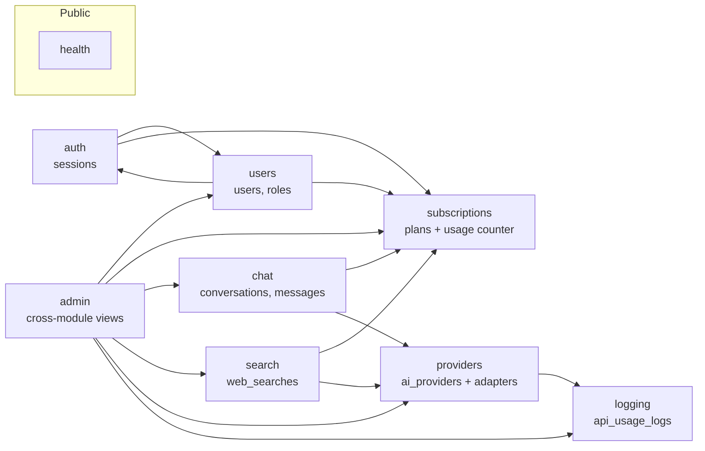
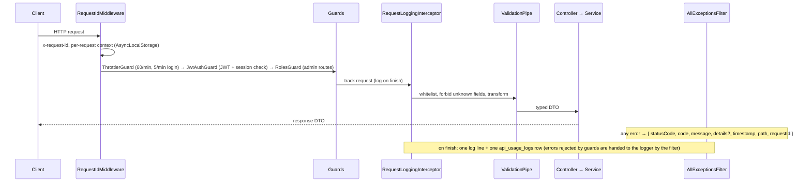
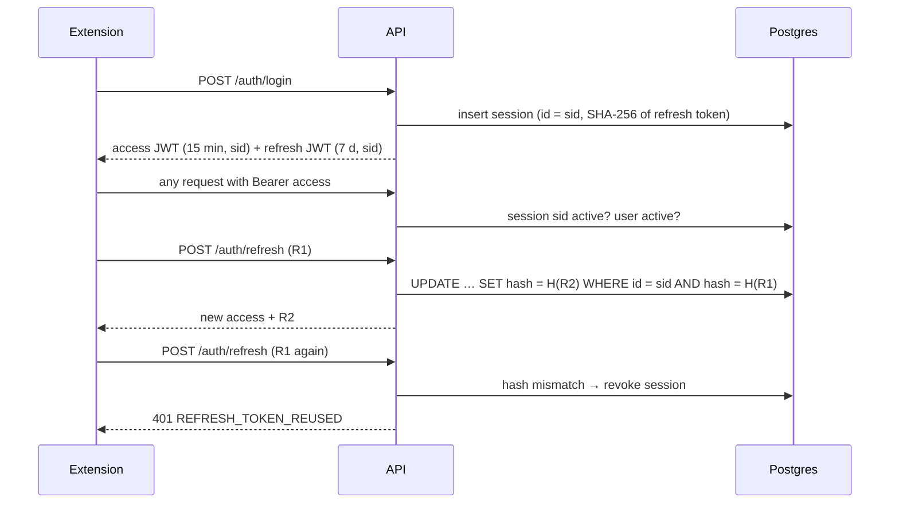
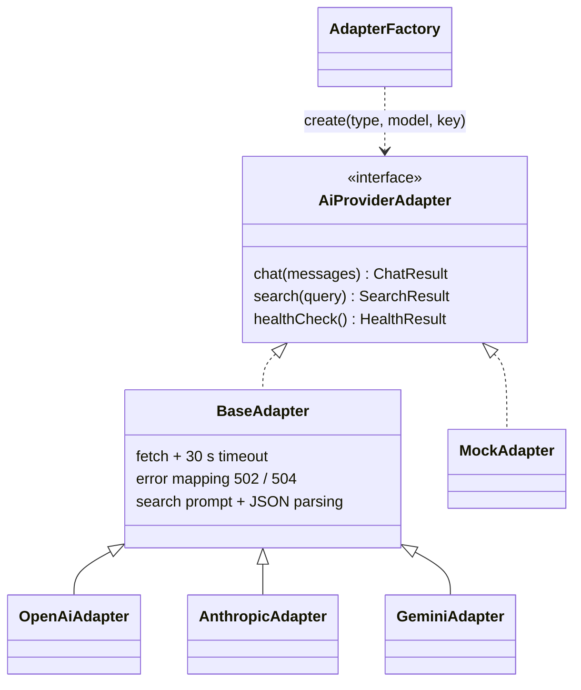

# Architecture

How the EchoGPT backend is put together. The product rules are in [PRD.md](./PRD.md), the database in [ERD.md](./ERD.md), and the reasons behind implementation choices in [DECISIONS.md](./DECISIONS.md).

## 1. Modules

One NestJS module per business area. Each module owns its tables; other modules use its **exported service**, never its repository.



| Module | Owns | Exposes to others |
|---|---|---|
| `auth` | `sessions` | `TokenService` (create / rotate / revoke sessions) |
| `users` | `users`, `roles` | `UsersService` (create, login lookup, profile, stats) |
| `subscriptions` | `subscriptions` | `SubscriptionsService.useRequest()`, `giveBackRequest()`, `getUsage()` |
| `providers` | `ai_providers` | `ProvidersService.resolveForUse()` → `{ provider, adapter }` |
| `chat` | `conversations`, `chat_messages` | `ChatService.countPromptsToday()` |
| `search` | `web_searches` | `SearchService.countToday()` |
| `logging` | `api_usage_logs` | `ApiUsageLogService` (write rows, analytics queries) |
| `admin` | — | read-only dashboard, analytics, logs, system health |
| `health` | — | public `GET /health` |

A feature's own admin routes (`/admin/users`, `/admin/subscriptions`, `/admin/providers`) live in that feature's module as `admin-*.controller.ts`, so business rules exist once.

## 2. Request lifecycle



- **Controllers are thin**: validate → call one service method → return a DTO.
- **Services hold the rules** and throw `AppException(status, code, message, details)`.
- **Response DTOs** are plain objects built by services; no entity is returned directly, so hashes and encrypted keys can't leak.

## 3. Authentication



- Access and refresh tokens use **different secrets** and a `typ` claim, so one can't be used as the other.
- Every request checks the session row, so **logout, logout-all, password change, suspension and account delete take effect immediately**.
- Refresh rotation is a compare-and-swap `UPDATE`, so two concurrent uses of the same token can't both win.

## 4. Usage limits

One atomic statement checks and counts (ERD §3):

```sql
UPDATE subscriptions
SET requests_used = CASE WHEN usage_date = CURRENT_DATE THEN requests_used + 1 ELSE 1 END,
    usage_date    = CURRENT_DATE
WHERE user_id = $1
  AND (usage_date <> CURRENT_DATE OR requests_used < CASE plan WHEN 'PREMIUM' THEN $3 ELSE $2 END)
RETURNING plan, requests_used, (CURRENT_DATE + 1)::timestamptz AS resets_at;
```

Postgres locks the row, so at `limit − 1` exactly one of many concurrent requests succeeds (test T6). Connections run in UTC, so "today" is the UTC day. A failed AI call gives the request back.

## 5. AI provider layer



- `ProvidersService.resolveForUse(providerId?)` returns the provider (or the default) and an adapter. Unknown → 404, disabled → `409 PROVIDER_DISABLED`.
- Keys are stored AES-256-GCM encrypted (`iv:authTag:ciphertext`), loaded only when an adapter is built, and never returned or logged.
- Web search is AI-assisted: the adapter asks the model for JSON `{answer, results[{title,url,snippet}]}` and tolerates non-JSON answers.
- Adding a provider = one adapter class + one `case` in `AdapterFactory` + one enum value.

## 6. Data and observability

- Schema changes only through migrations; `synchronize` is off. Entities mirror the ERD exactly (checked with `migration:generate`: "No changes").
- `api_usage_logs` gets one row per HTTP request (method, path without query string, status, duration, IP, user) plus AI fields (feature, provider, success) when a provider was called. Request bodies are never stored.
- Search results are cached in `web_searches` itself (same normalized query + provider, 1 hour).

## 7. Scaling notes

- Stateless API: JWT + DB sessions, so any number of instances can run behind a load balancer.
- Usage counters and the search cache are in Postgres today; both can move to Redis without changing the service interfaces.
- The in-memory rate limiter is per instance; a shared store (Redis) is needed for exact limits across instances.
- `api_usage_logs` is append-only with a `bigint` identity key and can be partitioned by month.
