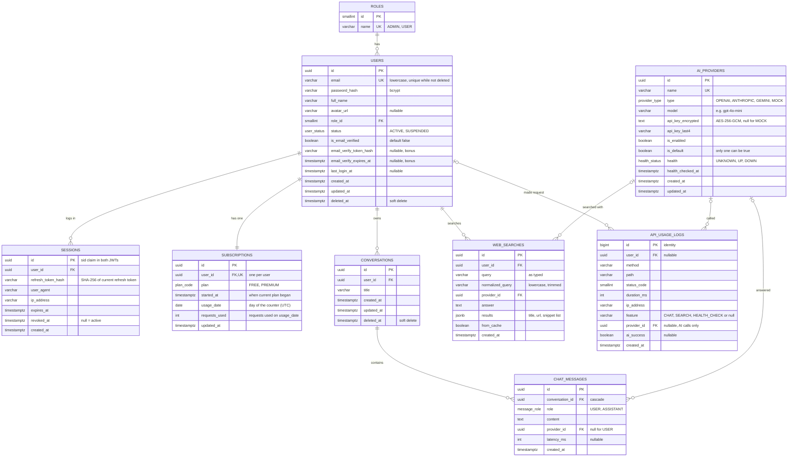

# EchoGPT Backend — Database Design (ERD)

**Database:** PostgreSQL 16 · **ORM:** TypeORM (entities + migrations, `synchronize: false`)

**9 tables, 5 enums.** These are exactly the tables the brief asks for, and nothing more:

| Brief asks for | Table(s) |
|---|---|
| Users | `users` |
| Sessions | `sessions` |
| Roles | `roles` |
| Subscriptions | `subscriptions` (also holds today's usage counter) |
| AI Providers | `ai_providers` |
| Chat History | `conversations` + `chat_messages` |
| Web Searches | `web_searches` (also serves as the search cache) |
| API Usage Logs | `api_usage_logs` (every HTTP request + every AI call) |

The rules that protect data are enforced **by the database**: unique email, one subscription per user, one default provider, and the daily usage limit.

---

## 1. Entity Relationship Diagram



---

## 2. Enums

| Enum | Values |
|---|---|
| `user_status` | `ACTIVE`, `SUSPENDED` |
| `plan_code` | `FREE`, `PREMIUM` |
| `provider_type` | `OPENAI`, `ANTHROPIC`, `GEMINI`, `MOCK` |
| `health_status` | `UNKNOWN`, `UP`, `DOWN` |
| `message_role` | `USER`, `ASSISTANT` |

**Plan details live in config, not in a table:**

| Plan | Daily limit (env) | Price (shown only) |
|---|---|---|
| `FREE` | `FREE_DAILY_LIMIT=20` | 0 |
| `PREMIUM` | `PREMIUM_DAILY_LIMIT=500` | $9.99 / month |

With only two fixed plans, a `plans` table would add a join everywhere for no benefit. If admins ever need to create plans, `plan_code` becomes a `plans` table (see §7).

---

## 3. Tables, one by one

### `roles`
Lookup table with two rows: `ADMIN`, `USER`. `users.role_id` points here. It's a table (not an enum) because the brief lists "Roles" as a table, and a new role is then just an insert.

### `users`
| Column | Rule |
|---|---|
| `email` | lowercased before save. Partial unique index `uq_users_email` on `(email) WHERE deleted_at IS NULL`: a deleted account frees its email. |
| `password_hash` | bcrypt, never returned by any endpoint |
| `role_id` | FK → `roles`, `ON DELETE RESTRICT` |
| `status` | `SUSPENDED` users can't log in or refresh |
| `email_verify_*` | bonus email verification: token stored hashed, expires in 24 h, cleared once used. No extra table needed: a user has at most one pending token. |
| `deleted_at` | soft delete (delete account). The user can't log in; history and logs stay consistent. |

### `sessions`
One row per login (per device). It powers refresh tokens, logout and logout-all.
- `id` is put in both JWTs as `sid`. The JWT guard checks the session isn't revoked, so **logout works immediately**.
- `refresh_token_hash` = SHA-256 of the **current** refresh token. On refresh a new token is issued and its hash replaces the old one (**rotation**). If an old token is used again, the hash doesn't match → the session is revoked (**reuse detection**).
- `revoked_at` is set on logout, logout-all, password change, account delete or suspension.

### `subscriptions`: plan + today's usage in one row
| Column | Rule |
|---|---|
| `user_id` | **UNIQUE**: every user has exactly one subscription row, created at registration (FREE). |
| `plan` | `FREE` / `PREMIUM`. Upgrade/downgrade = update this column + `started_at`. |
| `usage_date`, `requests_used` | today's counter. It resets automatically when the day changes (see below). |
| CHECK | `requests_used >= 0` |

**The usage limit is one atomic SQL statement.** It counts the request and checks the limit together:
```sql
UPDATE subscriptions
SET requests_used = CASE WHEN usage_date = CURRENT_DATE THEN requests_used + 1 ELSE 1 END,
    usage_date    = CURRENT_DATE,
    updated_at    = now()
WHERE user_id = :userId
  AND (usage_date <> CURRENT_DATE OR requests_used < :dailyLimit)
RETURNING requests_used;
-- 1 row  → allowed, remaining = dailyLimit - requests_used
-- 0 rows → limit reached → 429 USAGE_LIMIT_EXCEEDED
```
Two requests at the same moment can't both take the last slot: Postgres locks the row, and the second UPDATE re-checks the condition after the first commits. If the AI call then fails, the request is given back (`requests_used - 1`).

### `ai_providers`
| Column | Rule |
|---|---|
| `name` | unique |
| `api_key_encrypted` | AES-256-GCM, stored as `iv:authTag:ciphertext` (base64), key from `ENCRYPTION_KEY` env. TypeORM `select: false`, so it's never loaded by accident. |
| `api_key_last4` | used only to show a masked key: `••••a1b2` |
| `is_default` | partial unique index `uq_ai_providers_default` on `(is_default) WHERE is_default` → at most one default |
| CHECK | `ck_ai_providers_default_enabled`: `NOT is_default OR is_enabled` → the default must be enabled |

### `conversations` + `chat_messages`: chat history
- A conversation belongs to one user and has a title (first 60 characters of the first prompt). Soft delete.
- `chat_messages` stores every prompt (`USER`) and every answer (`ASSISTANT`) in order. `provider_id` and `latency_ms` are filled only for answers. Cascade-deleted with the conversation.

### `web_searches`: history **and** cache
- Every search is saved with its `answer` and `results`, so this table powers history, recent searches and suggestions.
- **Cache (bonus):** before calling the provider, look for a row with the same `normalized_query` + `provider_id` created in the last hour. If one exists, reuse its answer and results, and save the new row with `from_cache = true`. No separate cache table is needed.

### `api_usage_logs`: request logs **and** usage analytics
One row per HTTP request, written by a global interceptor.
- `method`, `path`, `status_code`, `duration_ms`, `ip_address`, `user_id` → admin **request logs** and dashboard stats.
- `feature`, `provider_id`, `ai_success` are filled only when the request called an AI provider → **API usage analytics** (per feature, per provider, success rate, average latency).
- Request bodies are never stored (they may contain passwords or prompts). Append-only, `bigint identity` key.

---

## 4. Indexes

| Index | Columns | Serves |
|---|---|---|
| `uq_users_email` | `users(email) WHERE deleted_at IS NULL` | login, unique email |
| `ix_sessions_user` | `sessions(user_id) WHERE revoked_at IS NULL` | logout-all |
| `uq_subscriptions_user` | `subscriptions(user_id)` UNIQUE | one subscription per user, usage update |
| `uq_ai_providers_default` | `ai_providers(is_default) WHERE is_default` | one default |
| `ix_conversations_user` | `conversations(user_id, updated_at DESC)` | conversation list |
| `ix_chat_messages_conversation` | `chat_messages(conversation_id, created_at)` | messages in order |
| `ix_web_searches_user` | `web_searches(user_id, created_at DESC)` | history, recent |
| `ix_web_searches_cache` | `web_searches(normalized_query, provider_id, created_at DESC)` | cache lookup, suggestions |
| `ix_api_usage_logs_created` | `api_usage_logs(created_at)` | logs by date, dashboard |
| `ix_api_usage_logs_feature` | `api_usage_logs(feature, created_at) WHERE feature IS NOT NULL` | usage analytics |

---

## 5. Foreign keys: what happens on delete

| FK | On delete | Why |
|---|---|---|
| `users.role_id → roles` | RESTRICT | a role in use can't be deleted |
| `sessions.user_id`, `subscriptions.user_id → users` | CASCADE | useless without the user |
| `conversations.user_id`, `web_searches.user_id → users` | RESTRICT | users are soft-deleted; history stays |
| `chat_messages.conversation_id → conversations` | CASCADE | messages belong to their conversation |
| `chat_messages / web_searches / api_usage_logs .provider_id → ai_providers` | SET NULL | deleting a provider keeps the history |
| `api_usage_logs.user_id → users` | SET NULL | logs survive for analytics |

---

## 6. Seed data

| What | Values |
|---|---|
| Roles | `ADMIN`, `USER` |
| Users | `admin@echogpt.dev` (ADMIN, PREMIUM) · `alice@echogpt.dev` (USER, FREE) · `bob@echogpt.dev` (USER, PREMIUM), password `Password123!` (demo only) |
| Providers | `Mock AI` (MOCK, enabled, **default**) · `OpenAI` (gpt-4o-mini) · `Claude` (claude-haiku) · `Gemini` (gemini-flash), the last three disabled with no key until an admin adds one |

With this seed the whole API works without any paid AI key.

---

## 7. Simplifications, and when to undo them

| Simplified | Instead of | Undo it when |
|---|---|---|
| Plan + daily counter in `subscriptions` | `plans` + `subscription_history` + `usage_counters` tables | admins need custom plans, billing history, or per-day usage reports |
| Email-verify token on `users` | separate token table | multiple token types (password reset, magic link) are added |
| Cache inside `web_searches` | separate `search_cache` table | cache needs its own eviction or sharing across users at scale |
| One `api_usage_logs` table | separate request logs and AI usage logs | log volume grows → partition by month or move to a log store |

---

## 8. TypeORM example

```ts
@Entity('subscriptions')
@Check('ck_subscriptions_requests_used', '"requests_used" >= 0')
export class Subscription {
  @PrimaryGeneratedColumn('uuid') id: string;

  @OneToOne(() => User, { onDelete: 'CASCADE' })
  @JoinColumn({ name: 'user_id' })
  user: User;

  @Column({ name: 'user_id', type: 'uuid', unique: true }) userId: string;
  @Column({ type: 'enum', enum: PlanCode, enumName: 'plan_code', default: PlanCode.FREE }) plan: PlanCode;
  @Column({ name: 'started_at', type: 'timestamptz', default: () => 'now()' }) startedAt: Date;
  @Column({ name: 'usage_date', type: 'date', default: () => 'CURRENT_DATE' }) usageDate: string;
  @Column({ name: 'requests_used', type: 'int', default: 0 }) requestsUsed: number;
  @UpdateDateColumn({ name: 'updated_at', type: 'timestamptz' }) updatedAt: Date;
}
```